<p align="center">
  
</p>
<h1 align="center">Pster's AI Workflow</h1>
<p align="center">
  <strong>Self-documenting, hallucination-reducing, and predictable AI workflow for software teams.</strong>
</p>
<p align="center">
  <a href="#pt-br">Português</a> · <a href="#en">English</a>
</p>
<p align="center">
  
  
  
  
  
</p>
<p align="center">
  <strong>Canonical repository:</strong> Opencode (supported derivative): Windsurf
</p>

## 🚀 Quick Start

### Platform Setup

| Platform | Install | Status |
|----------|---------|--------|
| **Opencode** | `cp -r .opencode/ /path/to/your/project/` | ⭐ **Canonical** |
| **Windsurf** | `cp -r .windsurf/ /path/to/your/project/` | ✅ Supported |

### For Opencode (Recommended)

1. Clone this repository:
   ```bash
   git clone https://github.com/J-Pster/Psters_AI_Workflow.git
   ```

2. Copy `.opencode/` to your project root:
   ```bash
   cp -r Psters_AI_Workflow/.opencode/ /path/to/your-project/
   ```

3. Restart OpenCode and run:
   ```bash
   /pwf-setup
   ```

### For Windsurf

1. Clone this repository:
   ```bash
   git clone https://github.com/J-Pster/Psters_AI_Workflow.git
   ```

2. Copy `.windsurf/` to your project root:
   ```bash
   cp -r Psters_AI_Workflow/.windsurf/ /path/to/your-project/
   ```

3. Restart Windsurf and run:
   ```bash
   /pwf-setup
   ```

### For Both Platforms

```bash
cp -r Psters_AI_Workflow/.opencode/ /path/to/your-project/
cp -r Psters_AI_Workflow/.windsurf/ /path/to/your-project/
```

## 📋 Main Commands (20 /pwf-*)

| Category | Command | Description |
|----------|---------|-------------|
| **Setup** | `/pwf-setup` | Initialize project docs skeleton |
| **Workspace** | `/pwf-setup-workspace` | Create multi-root structure (`*_Repos` + `*_Workspace`) |
| **Brainstorm** | `/pwf-brainstorm` | Define scope, architecture direction, and decisions |
| **Plan** | `/pwf-plan` | Generate phased implementation plan |
| **Quality Gates** | `/pwf-checklist` | Validate requirement quality |
| **Quality Gates** | `/pwf-clarify` | Resolve critical ambiguities |
| **Quality Gates** | `/pwf-analyze` | Read-only consistency/coverage analysis |
| **Work** | `/pwf-work-plan` | Implement one phase of the plan |
| **Work** | `/pwf-work` | Execute focused changes outside formal plan |
| **Review** | `/pwf-review` | Structured multi-agent review |
| **Commit** | `/pwf-commit-changes` | Create structured ticket-aware commits |
| **Docs** | `/pwf-doc` | Scoped documentation (module, feature, architecture) |
| **Docs** | `/pwf-doc-foundation` | Foundation docs (infra, architecture, integrations) |
| **Docs** | `/pwf-doc-runbook` | Operational runbooks |
| **Docs** | `/pwf-doc-capture` | Capture reusable learnings |
| **Docs** | `/pwf-doc-refresh` | Curate and update `docs/solutions/` |
| **Docs** | `/pwf-doc-update` | Update existing documentation |
| **Help** | `/pwf-help` | Command guide and workflow orientation |
| **AWS** | `/pwf-aws-lambda-deploy` | Guarded Lambda deployment flow |
| **Aux** | `/pwf-checklist` | Quality checklist (extra) |

## 🔄 Workflow Flow

```mermaid
%%{init: {"flowchart": {"curve": "linear", "rankSpacing": 40, "nodeSpacing": 28}} }%%
flowchart LR
  B["/pwf-brainstorm<br/>Define scope and decisions"] --> P["/pwf-plan<br/>Generate phased plan"]
  P --> Q{"Quality Gates?"}
  Q -->|Yes| C["/pwf-checklist<br/>Validate requirements"]
  C --> L["/pwf-clarify<br/>Resolve ambiguities"]
  L --> A["/pwf-analyze<br/>Consistency analysis"]
  A --> W["/pwf-work-plan<br/>Implement phase"]
  Q -->|No| W

  W --> R{"More phases?"}
  R -->|Yes| W
  R -->|No| V["/pwf-review<br/>Review findings"]
  V --> M["/pwf-commit-changes<br/>Structured commits"]

  X["/pwf-work<br/>Fast lane (informal plan)"] -.-> V
  D["Docs are central:<br/>Read and update automatically"] -.-> W
  D -.-> X

  classDef core fill:#EEF2FF,stroke:#4F46E5,color:#111827,stroke-width:1.2px;
  classDef quality fill:#ECFDF5,stroke:#059669,color:#111827,stroke-width:1.2px;
  classDef execution fill:#FFF7ED,stroke:#EA580C,color:#111827,stroke-width:1.2px;
  classDef close fill:#F5F3FF,stroke:#7C3AED,color:#111827,stroke-width:1.2px;
  classDef docs fill:#EFF6FF,stroke:#2563EB,color:#111827,stroke-width:1.2px;
  classDef decision fill:#F8FAFC,stroke:#475569,color:#0F172A,stroke-width:1.1px;

  class B,P core;
  class C,L,A quality;
  class W,X execution;
  class V,M close;
  class D docs;
  class Q,R decision;
```



### Default Flow

1. **/pwf-brainstorm** - Define scope, architecture direction, and key decisions
2. **/pwf-plan** - Generate phased implementation plan
3. **Quality Gates (optional)** - `/pwf-checklist`, `/pwf-clarify`, `/pwf-analyze`
4. **/pwf-work-plan** - Implement one phase at a time, repeating until complete
5. **/pwf-review** - Deep review when needed
6. **/pwf-commit-changes** - Structured ticket-aware commits

### Alternative Flow

**/pwf-work** - For focused, direct changes outside a formal plan

### Documentation Flow

All changes follow rules for:
- Mandatory reading before implementation
- Automatic documentation updates during execution

## 📚 Documentation

- **Main Index**: [docs/README.md](docs/README.md)
- **English Docs**: [docs/english/README.md](docs/english/README.md)
- **Portuguese Docs**: [docs/portuguese/README.md](docs/portuguese/README.md)

**English Quick Links**:
- [Getting Started](docs/english/getting-started.md)
- [Commands Reference](docs/english/commands-reference.md)
- [Suggested Project Structure](docs/english/suggested-project-structure.md)
- [Workflow Methodology](docs/english/workflow-methodology.md)
- [Under the Hood](docs/english/under-the-hood.md)
- [FAQ](docs/english/faq.md)

**Portuguese Quick Links**:
- [Comece em 10 Minutos](docs/portuguese/getting-started.md)
- [Referência de Comandos](docs/portuguese/commands-reference.md)
- [Estrutura de Projeto](docs/portuguese/suggested-project-structure.md)
- [Metodologia do Workflow](docs/portuguese/workflow-methodology.md)
- [Por Dentro do Workflow](docs/portuguese/under-the-hood.md)
- [FAQ](docs/portuguese/faq.md)

## 🎯 Why This Workflow?

### Philosophy

Pster's AI Workflow follows a **Spec-Driven Development** mindset inspired by **Extreme Programming (XP)**:

- **Fast incremental delivery** (small batches, short feedback loops)
- **Dynamic rigor** (lightweight when simple, deeper when risk is higher)
- **Predictable execution** (explicit command-by-command flow)
- **Context-first implementation** to reduce hallucination
- **Standard preservation** through mandatory docs reads/updates

### Differentiators

- **Developer-controlled path** - AI doesn't choose automatically; you decide the next step
- **AI-executed rigor** - Once the path is chosen, AI follows structured guardrails
- **Docs as runtime memory** - Not optional artifacts; generated and maintained during delivery
- **Same flow that adapts** - Runs light or heavy without changing philosophy

### Who It's For

- **Development teams** who want predictability
- **Agile projects** needing structured execution
- **Architects and engineers** who value docs as code
- **Hybrid teams** (developers + AI assistants)

## 🌍 Community

- **Discord**: [Pster's AI Workflow Discord](https://discord.gg/vxyrWuqUhe)
- **Contribution**: [CONTRIBUTING.md](CONTRIBUTING.md)
- **License**: [LICENSE](LICENSE)

---

## 🇵🇹 Português (PT-BR)

### ⚡ Explicação Rápida

Um workflow de IA auto-documentado e agnóstico de modelo para qualquer projeto, framework e linguagem. Ele reduz alucinação e mantém a entrega previsível: o desenvolvedor controla o caminho, a IA executa as etapas, e os padrões do projeto permanecem consistentes.

### Fluxo Principal

1. **/pwf-brainstorm** - Definir escopo, direção de arquitetura e decisões
2. **/pwf-plan** - Gerar plano de implementação em fases
3. **Quality Gates (opcional)** - `/pwf-checklist`, `/pwf-clarify`, `/pwf-analyze`
4. **/pwf-work-plan** - Implementar uma fase por vez
5. **/pwf-review** - Revisar e corrigir findings
6. **/pwf-commit-changes** - Commits estruturados por ticket

### Docs Sugeridas

- [Comece em 10 Minutos](docs/portuguese/getting-started.md)
- [Estrutura de Projeto](docs/portuguese/suggested-project-structure.md)
- [Referência de Comandos](docs/portuguese/commands-reference.md)
- [Metodologia do Workflow](docs/portuguese/workflow-methodology.md)
- [Por Dentro do Workflow](docs/portuguese/under-the-hood.md)

---

## 🇬🇧 English

### ⚡ Quick Explanation

An auto-documenting, model-agnostic AI workflow for any project, framework, and language. It reduces hallucination and keeps delivery predictable: the developer controls the path, AI executes the steps, and project standards stay consistent.

### Main Flow

1. **/pwf-brainstorm** - Define scope, architecture direction, and key decisions
2. **/pwf-plan** - Generate phased implementation plan
3. **Quality Gates (optional)** - `/pwf-checklist`, `/pwf-clarify`, `/pwf-analyze`
4. **/pwf-work-plan** - Implement one phase at a time
5. **/pwf-review** - Review and fix findings
6. **/pwf-commit-changes** - Structured ticket-aware commits

### Recommended Documentation

- [Getting Started](docs/english/getting-started.md)
- [Suggested Project Structure](docs/english/suggested-project-structure.md)
- [Commands Reference](docs/english/commands-reference.md)
- [Workflow Methodology](docs/english/workflow-methodology.md)
- [Under the Hood](docs/english/under-the-hood.md)

---

<p align="center">
  
</p>
