<p align="center">
  
</p>
<h1 align="center">Pster's AI Workflow</h1>
<p align="center">
  <strong>Self-documenting, hallucination-reducing, and predictable AI workflow for software teams.</strong>
</p>
<p align="center">
  <a href="#quick-explanation-english">English</a> · <a href="#quick-explanation-portuguese">Português (PT-BR)</a>
</p>
<p align="center">
  
  
  
  
  
</p>

An auto-documenting, model-agnostic AI workflow for any project, framework, and language. It reduces hallucination and keeps delivery predictable: the developer controls the path, AI executes the steps, and project standards stay consistent.

```mermaid
%%{init: {"flowchart": {"curve": "linear", "rankSpacing": 40, "nodeSpacing": 28}} }%%
flowchart LR
  B["/pwf-brainstorm<br/>Define scope and decisions"] --> P["/pwf-plan<br/>Generate phased implementation plan"]
  P --> Q{"Use quality gates?"}
  Q -->|Yes| C["/pwf-checklist<br/>Validate requirement quality"]
  C --> L["/pwf-clarify<br/>Resolve critical ambiguities"]
  L --> A["/pwf-analyze<br/>Run read-only consistency analysis"]
  A --> W["/pwf-work-plan<br/>Implement one phase"]
  Q -->|No| W

  W --> R{"More phases pending?"}
  R -->|Yes| W
  R -->|No| V["/pwf-review<br/>Review and fix findings"]
  V --> M["/pwf-commit-changes<br/>Create structured commits"]

  X["/pwf-work<br/>Fast lane outside formal plan"] -. optional lane .-> V
  D["Docs are central:<br/>/pwf-work and /pwf-work-plan read docs first<br/>and update docs automatically"] -.-> W
  D -.-> X

  classDef core fill:#EEF2FF,stroke:#4F46E5,color:#111827,stroke-width:1.2px;
  classDef quality fill:#ECFDF5,stroke:#059669,color:#111827,stroke-width:1.2px;
  classDef execution fill:#FFF7ED,stroke:#EA580C,color:#111827,stroke-width:1.2px;
  classDef close fill:#F5F3FF,stroke:#7C3AED,color:#111827,stroke-width:1.2px;
  classDef docs fill:#EFF6FF,stroke:#2563EB,color:#111827,stroke-width:1.2px;
  classDef decision fill:#F8FAFC,stroke:#475569,color:#0F172A,stroke-width:1.1px;

  class B,P core;
  class C,L,A quality;
  class W,X execution;
  class V,M close;
  class D docs;
  class Q,R decision;
```



<a id="quick-explanation-english"></a>

## ⚡ Quick Explanation

The default flow is:
`/pwf-brainstorm` (shape feature scope and decisions) ->
`/pwf-plan` (turn decisions into phased implementation tasks) ->
`/pwf-work-plan` (implement one phase per execution, repeating until all phases are complete).

After `/pwf-plan`, you can run `/pwf-checklist`, `/pwf-clarify`, and `/pwf-analyze` as quality gates before implementation.

`/pwf-work-plan` executes planned phases.  
`/pwf-work` executes focused changes outside a formal plan.

This workflow prioritizes predictability: commands do not autonomously pick your path.
The developer understands each command and explicitly chooses the next step.

Predictability and documentation are the two central pillars of this plugin:
- `/pwf-work` and `/pwf-work-plan` read documentation before implementation and generate/maintain docs automatically during execution.
- when you want explicit documentation output, use `/pwf-doc` (scoped docs), `/pwf-doc-foundation` (foundation docs like infrastructure/architecture/integrations/environments/glossary), `/pwf-doc-runbook` (operational runbooks), `/pwf-doc-capture` (reusable learnings), and `/pwf-doc-refresh` (docs lifecycle curation).
- this keeps standards consistent and turns docs into reusable project memory for both AI and engineers.

Deep dive:
- [English Wiki](https://github.com/J-Pster/Psters_AI_Workflow/wiki)
- [English Workflow Methodology](https://github.com/J-Pster/Psters_AI_Workflow/wiki/English-Workflow-Methodology)
- [English Under The Hood](https://github.com/J-Pster/Psters_AI_Workflow/wiki/English-Under-The-Hood)

## 🚀 Quick Start

### Supported Platforms

| Platform | Directory | Install Command |
|----------|-----------|-----------------|
| **Claude Code** | `.claude/` + `.claude-plugin/` | `./scripts/install-claude-code.sh [project-path]` |
| **Trae** | `.trae/` | `node scripts/install-workflow-bridge.mjs --to trae --project /path/to/project` |
| **Cursor** | `plugins/` | `./scripts/install-plugin-local.sh` |

### 1) Install and start using immediately

**For Claude Code:**
```bash
./scripts/install-claude-code.sh /path/to/your/project
```

**For Trae:**
```bash
node scripts/install-workflow-bridge.mjs --to trae --project /path/to/your/project
```

**For Cursor:**
```bash
./scripts/install-plugin-local.sh
```

**Install for all platforms at once:**
```bash
node scripts/install-workflow-bridge.mjs --to all --project /path/to/your/project
```

After installation, restart your editor and start with:
- `/pwf-help` (quick orientation)
- `/pwf-brainstorm` or `/pwf-work` (first real task)

### 2) If your project is NEW

Recommended setup:

1. `/pwf-setup-workspace` to create `<ProjectName>_Repos` + `<ProjectName>_Workspace`.
2. Open the generated `.code-workspace` in Cursor.
3. `/pwf-setup` to initialize docs skeleton.
4. `/pwf-doc-foundation all` to create baseline docs.

### 3) If your project ALREADY EXISTS

Recommended setup:

1. `/pwf-setup` to create/repair workflow docs structure.
2. `/pwf-doc-foundation all` to document current architecture/infrastructure/integrations/environments/glossary.
3. Use manual scoped documentation commands for existing areas:
   - `/pwf-doc module <name>`
   - `/pwf-doc feature <name>`
   - `/pwf-doc update`
   - `/pwf-doc-runbook <service-or-operation>` (when operations are undocumented)
4. Then continue with `/pwf-brainstorm` + `/pwf-plan` + `/pwf-work-plan`, or `/pwf-work` for focused direct changes.

If you are unsure about any command, run `/pwf-help` and ask it to explain that command without executing it (example: "explain `/pwf-doc-foundation` only").

Need a deeper onboarding path?
- [English Getting Started (Wiki)](https://github.com/J-Pster/Psters_AI_Workflow/wiki/English-Getting-Started)
- [English Commands Reference (Wiki)](https://github.com/J-Pster/Psters_AI_Workflow/wiki/English-Commands-Reference)

### Primary workflow steps

- **Step 1 — `/pwf-brainstorm`**: explore the feature scope, architecture direction, and key decisions.
- **Step 2 — `/pwf-plan`**: generate the phased implementation plan and executable tasks.
  - After `/pwf-plan`, optionally run quality gates before execution:
    - `/pwf-checklist` — validate requirement quality.
    - `/pwf-clarify` — resolve high-impact ambiguities.
    - `/pwf-analyze` — run read-only consistency/coverage analysis across plan and docs.
- **Step 3 — `/pwf-work-plan`**: implement one phase from the plan, then repeat until all phases are complete.

### Additional execution paths

### Work lane commands (outside the main phased path)

- `/pwf-work` — direct execution lane for focused changes outside formal plan.
- `/pwf-work-light` — lightweight path for trivial/local changes.
- `/pwf-work-tdd` — tests-first execution when explicitly requested.

### Review and delivery commands

- `/pwf-review` — structured multi-agent review.
- `/pwf-commit-changes` — structured ticket-aware commits (not part of the primary 3-command flow, but part of delivery closure).

### Documentation commands

- `/pwf-doc` — scoped documentation hub to generate/update specific docs (module, feature, architecture, ADR, infrastructure, full update, and custom targets).
- `/pwf-doc-foundation` — create/refresh core project docs baseline (`infrastructure`, `architecture`, `integrations`, `environments`, `glossary`).
- `/pwf-doc-runbook` — create/refresh operational runbooks under `docs/runbooks/`.
- `/pwf-doc-capture` — capture reusable learnings/patterns after solving non-trivial work.
- `/pwf-doc-refresh` — review and curate `docs/solutions/` lifecycle (keep, update, replace, archive) with user approval.

If you are unsure which docs command to use, ask `/pwf-help` to compare them first.

### Auxiliary commands

- `/pwf-help` — command guide and workflow orientation.
- `/pwf-setup` — initialize/repair project docs skeleton.
- `/pwf-setup-workspace` — create recommended multi-root project layout (`*_Repos` + `*_Workspace`) and workspace file.
- `/pwf-aws-lambda-deploy` — guarded Lambda deployment flow when relevant.

## 🧩 Why This Workflow Exists

Pster's AI Workflow follows a **Spec-Driven Development** mindset inspired by **Extreme Programming (XP)**:

- fast incremental delivery (small batches, short feedback loops),
- dynamic depth (lightweight when simple, deeper when risk is higher),
- predictable execution (explicit command-by-command flow),
- context-first implementation to reduce hallucination,
- standard preservation through mandatory documentation reads/updates.

This project was informed by practical lessons from:

- Compound Engineering,
- Superpowers,
- SpecKit (GitHub).

What is different in this workflow:

- **Developer-controlled path:** commands do not auto-pick the next strategy; the developer explicitly chooses the path.
- **AI-executed rigor:** once the path is chosen, AI executes with structured guardrails.
- **Documentation as core runtime memory:** docs are not optional artifacts; they are generated and maintained during delivery.
- **Single flow that adapts:** same workflow can run light or heavy without changing philosophy.

Learn the full rationale:
- [English Workflow Methodology (Wiki)](https://github.com/J-Pster/Psters_AI_Workflow/wiki/English-Workflow-Methodology)
- [English Under The Hood (Wiki)](https://github.com/J-Pster/Psters_AI_Workflow/wiki/English-Under-The-Hood)
- [English Extreme Programming (Wiki)](https://github.com/J-Pster/Psters_AI_Workflow/wiki/English-Extreme-Programming)

## 🚀 Why Teams Choose It

- **Modular by design:** commands, skills, agents, rules, and hooks each have clear responsibilities.
- **Dynamic rigor:** small tasks can move fast; critical tasks can activate stronger guardrails and deeper analysis.
- **Documentation as system memory:** project `docs/` is continuously generated, updated, and reused for future work.
- **Project-agnostic:** usable in new or existing projects, across stacks and languages.
- **Open source and extensible:** community can add capabilities, commands, agents, and rules.

## 📚 Documentation and Wiki

- Main Wiki entry point: [Psters AI Workflow Wiki](https://github.com/J-Pster/Psters_AI_Workflow/wiki)
- Wiki highlights:
  - [English Getting Started](https://github.com/J-Pster/Psters_AI_Workflow/wiki/English-Getting-Started)
  - [English Suggested Project Structure](https://github.com/J-Pster/Psters_AI_Workflow/wiki/English-Suggested-Project-Structure)
  - [English Workflow Methodology](https://github.com/J-Pster/Psters_AI_Workflow/wiki/English-Workflow-Methodology)
  - [English Commands Reference](https://github.com/J-Pster/Psters_AI_Workflow/wiki/English-Commands-Reference)
  - [English FAQ](https://github.com/J-Pster/Psters_AI_Workflow/wiki/English-Faq)
  - [Portuguese Wiki](https://github.com/J-Pster/Psters_AI_Workflow/wiki/Wiki-Portuguese)
- Main docs index: [docs/README.md](docs/README.md)
- English docs: [docs/english/README.md](docs/english/README.md)
- Portuguese docs: [docs/portuguese/README.md](docs/portuguese/README.md)
- Wiki publishing flow:
  - [docs/english/wiki-sync.md](docs/english/wiki-sync.md)
  - [docs/portuguese/wiki-sync.md](docs/portuguese/wiki-sync.md)

## 🌍 Community and Contribution

- Discord: [Pster's AI Workflow Discord](https://discord.gg/vxyrWuqUhe)
- Featured article:
  - [Gasto mais de R$1.500/mês em IA e faturo mais de R$40.000/mês, O segredo é o workflow!](https://www.linkedin.com/pulse/gasto-mais-de-r1500m%25C3%25AAs-em-ia-e-faturo-r40000m%25C3%25AAs-o-segredo-viana-fglwf/)

Contribute with ideas or code via GitHub issues and pull requests.
Contribution guide: [CONTRIBUTING.md](CONTRIBUTING.md)

---

<a id="quick-explanation-portuguese"></a>

## ⚡ Explicacao Rapida (Português - PT-BR)

Um workflow de IA auto-documentado e agnóstico de modelo para qualquer projeto, framework e linguagem. Ele reduz alucinação e mantém a entrega previsível: o desenvolvedor controla o caminho, a IA executa as etapas, e os padrões do projeto permanecem consistentes.

```mermaid
%%{init: {"flowchart": {"curve": "linear", "rankSpacing": 40, "nodeSpacing": 28}} }%%
flowchart LR
  B["/pwf-brainstorm<br/>Definir escopo e decisoes"] --> P["/pwf-plan<br/>Gerar plano de implementacao em fases"]
  P --> Q{"Usar quality gates?"}
  Q -->|Sim| C["/pwf-checklist<br/>Validar qualidade dos requisitos"]
  C --> L["/pwf-clarify<br/>Resolver ambiguidades criticas"]
  L --> A["/pwf-analyze<br/>Analise read-only de consistencia"]
  A --> W["/pwf-work-plan<br/>Implementar uma fase"]
  Q -->|Nao| W

  W --> R{"Ainda existem fases pendentes?"}
  R -->|Sim| W
  R -->|Nao| V["/pwf-review<br/>Revisar e corrigir findings"]
  V --> M["/pwf-commit-changes<br/>Gerar commits estruturados"]

  X["/pwf-work<br/>Faixa rapida fora do plano formal"] -. caminho opcional .-> V
  D["Docs sao centrais:<br/>/pwf-work e /pwf-work-plan leem docs antes<br/>e atualizam docs automaticamente"] -.-> W
  D -.-> X

  classDef core fill:#EEF2FF,stroke:#4F46E5,color:#111827,stroke-width:1.2px;
  classDef quality fill:#ECFDF5,stroke:#059669,color:#111827,stroke-width:1.2px;
  classDef execution fill:#FFF7ED,stroke:#EA580C,color:#111827,stroke-width:1.2px;
  classDef close fill:#F5F3FF,stroke:#7C3AED,color:#111827,stroke-width:1.2px;
  classDef docs fill:#EFF6FF,stroke:#2563EB,color:#111827,stroke-width:1.2px;
  classDef decision fill:#F8FAFC,stroke:#475569,color:#0F172A,stroke-width:1.1px;

  class B,P core;
  class C,L,A quality;
  class W,X execution;
  class V,M close;
  class D docs;
  class Q,R decision;
```



Fluxo padrão:
`/pwf-brainstorm` (definir escopo e decisões) ->
`/pwf-plan` (transformar decisões em tarefas por fase) ->
`/pwf-work-plan` (implementar uma fase por execução, repetindo até concluir todas as fases).

Depois do `/pwf-plan`, você pode rodar `/pwf-checklist`, `/pwf-clarify` e `/pwf-analyze` como quality gates antes da implementação.

`/pwf-work-plan` executa fases planejadas.  
`/pwf-work` executa mudanças focadas fora de um plano formal.

Este workflow prioriza previsibilidade: os comandos não escolhem o caminho por conta própria.
O desenvolvedor entende cada comando e escolhe explicitamente o próximo passo.

Previsibilidade e documentação são os dois pilares centrais deste plugin:
- `/pwf-work` e `/pwf-work-plan` leem documentação antes de implementar e geram/mantêm docs automaticamente durante a execução.
- quando você quer saída explícita de documentação, use `/pwf-doc` (docs por escopo), `/pwf-doc-foundation` (base de docs como infrastructure/architecture/integrations/environments/glossary), `/pwf-doc-runbook` (runbooks operacionais), `/pwf-doc-capture` (aprendizados reutilizáveis) e `/pwf-doc-refresh` (curadoria do ciclo de vida de docs).
- isso mantém padrões consistentes e transforma docs em memória reutilizável para IA e engenharia.

Aprofundar:
- [Wiki em Português](https://github.com/J-Pster/Psters_AI_Workflow/wiki/Wiki-Portuguese)
- [Metodologia do Workflow (Wiki)](https://github.com/J-Pster/Psters_AI_Workflow/wiki/Portuguese-Workflow-Methodology)
- [Por Dentro do Workflow (Wiki)](https://github.com/J-Pster/Psters_AI_Workflow/wiki/Portuguese-Under-The-Hood)

## 🚀 Inicio Rapido

### Plataformas Suportadas

| Plataforma | Diretório | Comando de Instalação |
|------------|-----------|----------------------|
| **Claude Code** | `.claude/` + `.claude-plugin/` | `./scripts/install-claude-code.sh [caminho-projeto]` |
| **Trae** | `.trae/` | `node scripts/install-workflow-bridge.mjs --to trae --project /caminho/do/projeto` |
| **Cursor** | `plugins/` | `./scripts/install-plugin-local.sh` |

### 1) Instalar e começar a usar na hora

**Para Claude Code:**
```bash
./scripts/install-claude-code.sh /caminho/do/seu/projeto
```

**Para Trae:**
```bash
node scripts/install-workflow-bridge.mjs --to trae --project /caminho/do/seu/projeto
```

**Para Cursor:**
```bash
./scripts/install-plugin-local.sh
```

**Instalar para todas as plataformas de uma vez:**
```bash
node scripts/install-workflow-bridge.mjs --to all --project /caminho/do/seu/projeto
```

Após a instalação, reinicie seu editor e comece com:
- `/pwf-help` (orientação rápida)
- `/pwf-brainstorm` ou `/pwf-work` (primeira task real)

### 2) Se o projeto for NOVO

Setup recomendado:

1. `/pwf-setup-workspace` para criar `<NomeProjeto>_Repos` + `<NomeProjeto>_Workspace`.
2. Abra o `.code-workspace` gerado no Cursor.
3. `/pwf-setup` para inicializar o esqueleto de docs.
4. `/pwf-doc-foundation all` para criar documentação base.

### 3) Se o projeto JÁ EXISTE

Setup recomendado:

1. `/pwf-setup` para criar/reparar a estrutura de docs do workflow.
2. `/pwf-doc-foundation all` para documentar estado atual de architecture/infrastructure/integrations/environments/glossary.
3. Use comandos manuais de documentação por escopo nas áreas existentes:
   - `/pwf-doc module <name>`
   - `/pwf-doc feature <name>`
   - `/pwf-doc update`
   - `/pwf-doc-runbook <servico-ou-operacao>` (quando operações ainda não estão documentadas)
4. Depois siga com `/pwf-brainstorm` + `/pwf-plan` + `/pwf-work-plan`, ou use `/pwf-work` para mudanças diretas e focadas.

Se tiver dúvida sobre qualquer comando, rode `/pwf-help` e peça para explicar o comando sem executar (exemplo: "explique apenas `/pwf-doc-foundation`").

Quer onboarding completo com mais contexto?
- [Começando Agora (Wiki)](https://github.com/J-Pster/Psters_AI_Workflow/wiki/Portuguese-Getting-Started)
- [Referência de Comandos (Wiki)](https://github.com/J-Pster/Psters_AI_Workflow/wiki/Portuguese-Commands-Reference)

### Etapas principais do workflow

- **Step 1 — `/pwf-brainstorm`**: explorar escopo da feature, direção de arquitetura e decisões principais.
- **Step 2 — `/pwf-plan`**: gerar plano de implementação em fases e tarefas executáveis.
  - Depois do `/pwf-plan`, opcionalmente rode quality gates antes da execução:
    - `/pwf-checklist` — validar qualidade dos requisitos.
    - `/pwf-clarify` — resolver ambiguidades de alto impacto.
    - `/pwf-analyze` — análise read-only de consistência/cobertura entre plano e docs.
- **Step 3 — `/pwf-work-plan`**: implementar uma fase do plano e repetir até concluir todas as fases.

### Caminhos adicionais de execução

### Comandos da faixa work (fora do caminho principal em fases)

- `/pwf-work` — execução direta para mudanças focadas fora de plano formal.
- `/pwf-work-light` — caminho leve para mudanças triviais/locais.
- `/pwf-work-tdd` — execução tests-first quando solicitado explicitamente.

### Comandos de review e entrega

- `/pwf-review` — revisão estruturada com múltiplos agentes.
- `/pwf-commit-changes` — commits estruturados com ticket (não faz parte do fluxo principal de 3 comandos, mas fecha a entrega).

### Comandos de documentação

- `/pwf-doc` — hub de documentação por escopo (module, feature, architecture, ADR, infrastructure, full update e custom).
- `/pwf-doc-foundation` — cria/atualiza baseline de docs do projeto (`infrastructure`, `architecture`, `integrations`, `environments`, `glossary`).
- `/pwf-doc-runbook` — cria/atualiza runbooks operacionais em `docs/runbooks/`.
- `/pwf-doc-capture` — captura aprendizados/padrões reutilizáveis após trabalho não trivial.
- `/pwf-doc-refresh` — revisa e cura ciclo de vida de `docs/solutions/` (keep, update, replace, archive) com aprovação do usuário.

Se houver dúvida sobre qual comando de docs usar, peça ao `/pwf-help` para comparar os comandos antes.

### Comandos auxiliares

- `/pwf-help` — guia de comandos e orientação de workflow.
- `/pwf-setup` — inicializa/repara o esqueleto de documentação do projeto.
- `/pwf-setup-workspace` — cria layout multi-root recomendado (`*_Repos` + `*_Workspace`) e arquivo de workspace.
- `/pwf-aws-lambda-deploy` — fluxo protegido para deploy de Lambda quando aplicável.

## 🧩 Por Que Este Workflow Existe

O Pster's AI Workflow segue um mindset de **Spec-Driven Development** inspirado em **Extreme Programming (XP)**:

- entrega incremental rápida (lotes pequenos, ciclos curtos de feedback),
- profundidade dinâmica (leve no simples, mais robusto no risco alto),
- execução previsível (fluxo explícito comando a comando),
- implementação context-first para reduzir alucinação,
- preservação de padrão via leitura/atualização obrigatória de documentação.

Este projeto foi informado por lições práticas de:

- Compound Engineering,
- Superpowers,
- SpecKit (GitHub).

O que é diferente neste workflow:

- **Caminho controlado pelo desenvolvedor:** os comandos não escolhem estratégia automaticamente; o desenvolvedor escolhe o caminho explicitamente.
- **Rigor executado por IA:** após escolher o caminho, a IA executa com guardrails estruturados.
- **Documentação como memória operacional central:** docs não são artefatos opcionais; são geradas e mantidas durante a entrega.
- **Fluxo único e adaptável:** o mesmo workflow pode operar no modo leve ou profundo sem trocar de filosofia.

Entenda o racional completo:
- [Metodologia do Workflow (Wiki)](https://github.com/J-Pster/Psters_AI_Workflow/wiki/Portuguese-Workflow-Methodology)
- [Por Dentro do Workflow (Wiki)](https://github.com/J-Pster/Psters_AI_Workflow/wiki/Portuguese-Under-The-Hood)
- [Extreme Programming (XP) (Wiki)](https://github.com/J-Pster/Psters_AI_Workflow/wiki/Portuguese-Extreme-Programming)

## 🚀 Por Que Times Escolhem Este Workflow

- **Modular por design:** commands, skills, agents, rules e hooks têm responsabilidades claras.
- **Rigor dinâmico:** tarefas pequenas avançam rápido; tarefas críticas ativam mais guardrails e análise.
- **Documentação como memória de sistema:** `docs/` do projeto é gerada, atualizada e reutilizada continuamente.
- **Agnóstico de projeto:** funciona em projetos novos ou existentes, em diferentes stacks e linguagens.
- **Open source e extensível:** a comunidade pode adicionar capacidades, comandos, agentes e regras.

## 📚 Documentação e Wiki

- Entrada principal da Wiki: [Psters AI Workflow Wiki](https://github.com/J-Pster/Psters_AI_Workflow/wiki)
- Highlights da Wiki:
  - [Começando Agora](https://github.com/J-Pster/Psters_AI_Workflow/wiki/Portuguese-Getting-Started)
  - [Estrutura de Projeto Sugerida](https://github.com/J-Pster/Psters_AI_Workflow/wiki/Portuguese-Suggested-Project-Structure)
  - [Metodologia do Workflow](https://github.com/J-Pster/Psters_AI_Workflow/wiki/Portuguese-Workflow-Methodology)
  - [Referência de Comandos](https://github.com/J-Pster/Psters_AI_Workflow/wiki/Portuguese-Commands-Reference)
  - [Perguntas Frequentes (FAQ)](https://github.com/J-Pster/Psters_AI_Workflow/wiki/Portuguese-Faq)
  - [English Wiki](https://github.com/J-Pster/Psters_AI_Workflow/wiki/Wiki-English)
- Índice principal de docs: [docs/README.md](docs/README.md)
- Docs em inglês: [docs/english/README.md](docs/english/README.md)
- Docs em português: [docs/portuguese/README.md](docs/portuguese/README.md)
- Fluxo de publicação para wiki:
  - [docs/english/wiki-sync.md](docs/english/wiki-sync.md)
  - [docs/portuguese/wiki-sync.md](docs/portuguese/wiki-sync.md)

## 🌍 Comunidade e Contribuição

- Discord: [Pster's AI Workflow Discord](https://discord.gg/vxyrWuqUhe)
- Artigo em destaque:
  - [Gasto mais de R$1.500/mês em IA e faturo mais de R$40.000/mês, O segredo é o workflow!](https://www.linkedin.com/pulse/gasto-mais-de-r1500m%25C3%25AAs-em-ia-e-faturo-r40000m%25C3%25AAs-o-segredo-viana-fglwf/)

Contribua com ideias ou código via issues e pull requests no GitHub.
Guia de contribuição: [CONTRIBUTING.md](CONTRIBUTING.md)